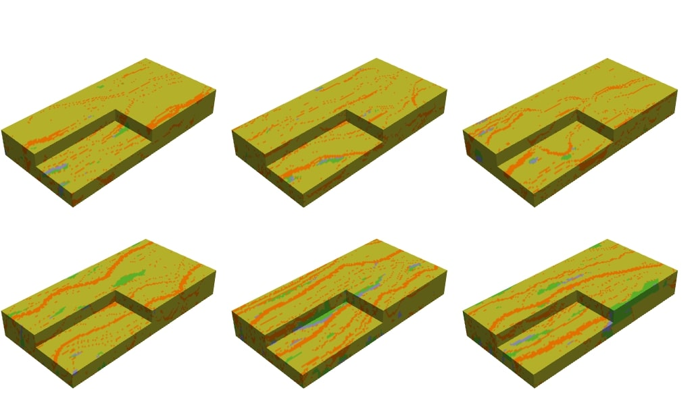

# A stable deep adversarial learning approach for geological facies generation

## Links and contact

ArXiv : https://arxiv.org/abs/2305.13318

**Contact**: ferdinand.bhavsar@minesparis.psl.eu

How to cite:

> @misc{
>      bhavsar2023principled,
>      title={A stable deep adversarial learning approach for geologicalfacies generation},
>      author={Ferdinand Bhavsar and Nicolas Desassis and Fabien Ors and Thomas Romary},
>      year={2023},
>      eprint={2305.13318},
>      archivePrefix={arXiv},
>      primaryClass={physics.geo-ph}
> }

## Abstract

The simulation of geological facies in an unobservable volume is essential in various geoscience applications. Given the complexity of the problem, deep generative learning is a promising approach to overcome the limitations of traditional geostatistical simulation models, in particular their lack of physical realism. This research aims to investigate the application of generative adversarial networks and deep variational inference for conditionally simulating meandering channelized reservoir in underground volumes. In this paper, we review the generative deep learning approaches, in particular the adversarial ones and the stabilization techniques that aim to facilitate their training. We also study the problem of conditioning deep learning models to observations through a variational Bayes approach, comparing a conditional neural network model to a Gaussian mixture model.
The proposed approach is tested on 2D and 3D simulations generated by the stochastic process-based model Flumy. Morphological metrics are utilized to compare our proposed method with earlier iterations of generative adversarial networks. The results indicate that by utilizing recent stabilization techniques, generative adversarial networks can efficiently sample from target data distributions.



## Usage

Models code is located in the subfolder **models**. Code examples are found in **notebooks**.

For example to use the 'best' models used in our tests:

``` python

# 2D model

from models.load_trained_models import load_msnwgen_2d_gs_horizontal

g_model = load_msnwgen_2d_gs_horizontal(checkpoint_file="./trainedweights/msnwgen2d_gs/cp-msnwgen_maxsort_horizontal_good.ckpt")
g_model.build([None, *noise_shape])
g_model.summary()
random_latent_vectors = tf.random.normal(shape=(30, 8, 16, 1))
generated_blocs = g_model(random_latent_vectors, training=True)


```


``` python

# 3D model

from models.load_trained_models import load_mswgen_sn_3d_horizontal

g_model = load_mswgen_sn_3d_horizontal("./trainedweights/mswgen3d/cp-gen2d_horizontal_good.ckpt")
g_model.summary()
random_latent_vectors = tf.random.normal(shape=(30, 4, 8, 16, 1))
generated_blocs = g_model(random_latent_vectors, training=True)

```

## Abbreviations

MS := Multiscale

W := Wasserstein

SN := Spectral Normalisation

GS := GroupSort


## Technical details and requirements

**Hardware requirements:** A GPU CUDA compatible installed is highly recommended. 16GB of System RAM, as well as GPU RAM, is recommended for 3D codes.

**Software requirements:** Python libraries are listed in requirements.txt, and to use Tensorflow with a GPU a CUDA installation is needed: https://docs.nvidia.com/cuda/cuda-installation-guide-linux/index.html

**The following codes do not belong to us:** spectral_normalization_layers.py: SpectralNormalization in Keras (Source: https://github.com/IShengFang/SpectralNormalizationKeras)

